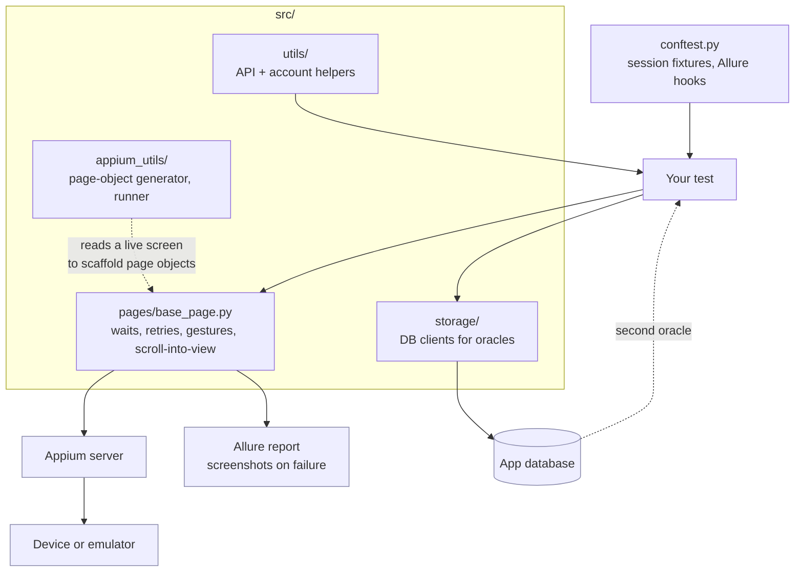

# appium-mobile-harness


The reusable half of a production mobile automation suite: a substantial Page
Object base class, Appium session management, a page-object generator that reads
a live screen, storage clients for oracle checks, and Allure reporting.

It is scaffolding. The page objects and tests for *your* app are yours to write;
this is everything underneath them.

## How a run is wired



## `src/pages/base_page.py`

Three thousand lines, and the reason the rest works. It wraps the parts of
Appium that make mobile tests flaky:

Waits that express intent rather than sleeping. Element lookups that retry the
way a human would and fail with a message naming what was being looked for.
Scroll-into-view that works on both platforms. Gesture helpers. Screenshot
capture on failure, attached to the report automatically.

Mobile tests fail for environmental reasons far more often than because the app
is broken. Most of this file is the difference between a suite people trust and
one they rerun until it goes green.

## Page object generation

`src/appium_utils/page_object_generator.py` and its cross-platform sibling read
the current screen's element tree and emit a starting page object into
`src/pages/`, with locators already filled in.

```bash
python -m src.appium_utils.page_object_generator --screen settings --output src/pages
```

It is a starting point, not a finished object. Generated locators lean on
whatever the screen exposes, and part of the job is replacing the fragile ones
with stable accessibility IDs. But it removes the tedious half of adding a
screen.

## Oracles

`src/storage/` holds the PostgreSQL client used to persist run results.

They are there because a mobile assertion is weak evidence on its own. A green
screen means the app rendered something; it does not mean the purchase was
recorded, the entitlement was granted, or the feature flag you are testing under
is actually the one that was live. Assert the UI, then verify the effect from a
source the app does not control.

Use read-only credentials for all three.

## Reporting

`src/reporting/` wires Allure: readable step names derived from method names,
screenshots on failure, and structured attachments.

## Setup

```bash
pip install -r requirements.txt
```

You need a running Appium server and a device or emulator. Configuration is via
environment and pytest options; there are no defaults pointing at a real device
farm.

```bash
pytest --platform android
```

## Providing the parts that aren't here

The harness deliberately ships no page objects for a real app and no test data,
since those are the parts specific to a product.

### `src/platform/` — the device layer

The session-management and generator paths import a `src.platform` package that
is not in this repository, because it encodes device-farm and OEM specifics that
do not generalise. You supply it. Three modules, and what is imported from each:

| Module | Must expose |
|---|---|
| `src/platform/driver_factory.py` | `DriverFactory` — builds a configured Appium driver |
| `src/platform/appium_client.py` | `AppiumClient`, `SessionInfraError`, `keep_session_alive` |
| `src/platform/oem_policy.py` | `OEM_POLICIES` — per-manufacturer quirks |

`base_page.py` imports `OEM_POLICIES` inside the method that needs it, so most
of the base class works without the package. `src/appium_utils/runner.py`
imports at module level and will not load without it. The unit tests do not
touch these paths, which is why the gate passes on a clean clone.

### `src/utils/transforms` — expected screen text

The `expected_screens` fixture in `conftest.py` expects a
`src/utils/transforms` module exposing `get_all_expected(backend_data)`, which
turns your backend payloads into the text each screen should display. Without it
that fixture skips rather than failing, so everything else still runs.

That pattern is worth keeping if you adopt this: driving expected UI text from
the backend response means a copy change or a config flip does not silently
invalidate the assertions.

## Scope

This is the harness only. App-specific page objects, test flows, personas and
API response transforms are yours to write against your own app.

## License

MIT. See [LICENSE](LICENSE).
