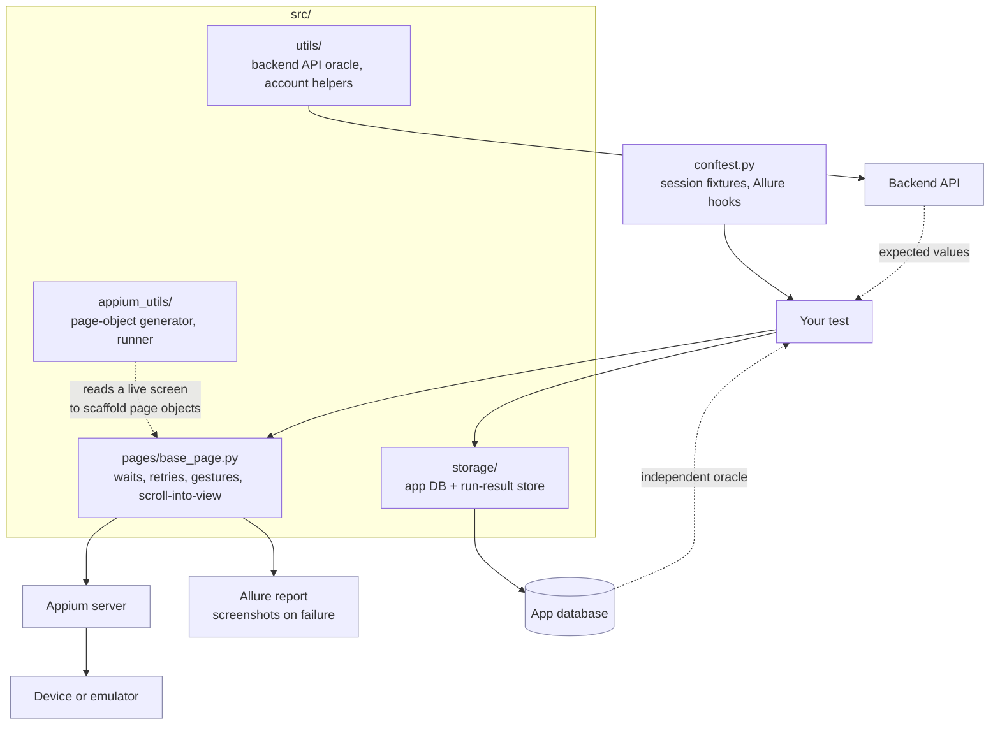

# appium-mobile-harness


The reusable half of a production mobile automation suite: a substantial Page
Object base class, Appium session management, a page-object generator that reads
a live screen, backend API and database clients for oracle checks, and Allure
reporting.

It is scaffolding. The page objects and tests for *your* app are yours to write;
this is everything underneath them.

## The problem it addresses

Mobile tests fail for environmental reasons far more often than because the app
is broken. A stale driver session, a permission dialog nobody expected, an
element that exists but has not finished animating, a device that rebooted
between runs — each one produces a red build that says nothing about the
product.

A suite that is red for those reasons stops being read. People rerun it until
it goes green, and by then it has stopped being a test of anything.

This is the layer that absorbs that: waits that express intent rather than
sleeping, lookups that retry the way a human would and fail naming what they
looked for, and two independent oracles so a green screen is not the only
evidence a purchase was recorded.

## How a run is wired



## `src/pages/base_page.py`

Three thousand lines, and the reason the rest works. It wraps the parts of
Appium that make mobile tests flaky:

Waits that express intent rather than sleeping. Element lookups that retry the
way a human would and fail with a message naming what was being looked for.
Scroll-into-view that works on both platforms. Gesture helpers. Screenshot
capture on failure, attached to the report automatically.

Most of this file is the difference between a suite people trust and one they
rerun until it goes green.

### Locators resolve per platform, once

Android and iOS disagree about how to find the same element. The base class
settles that in one place so page objects do not repeat it:

```python
def _by_id(self, rid: str) -> tuple:
    """testID prop lookup, fastest on both platforms."""
    if self.platform == "android":
        return (AppiumBy.ANDROID_UIAUTOMATOR,
                f'new UiSelector().resourceId("{rid}")')
    return (AppiumBy.ACCESSIBILITY_ID, rid)
```

The full set: `_by_id`, `_by_id_contains`, `_by_desc`, `_by_desc_contains`,
`_by_text`, `_by_text_contains`, `_by_class`, `_by_predicate`,
`_by_class_chain`.

`find_element` waits for *visibility*, not presence. An element that exists but
has not finished animating is the most common source of a red build that means
nothing.

## Writing a page object

Page objects stay thin. They name locators and expose intent; the base class
handles waiting, retrying and scrolling.

```python
from src.pages.base_page import BasePage


class SubscriptionPage(BasePage):
    PLAN_PRICE   = "subscription_plan_price"
    PLAN_NAME    = "subscription_plan_name"
    SUBSCRIBE_BTN = "subscription_subscribe_button"

    def plan_price(self) -> str:
        return self.find_element(*self._by_id(self.PLAN_PRICE)).text

    def plan_name(self) -> str:
        return self.find_element(*self._by_id(self.PLAN_NAME)).text

    def subscribe(self) -> None:
        self.find_element(*self._by_id(self.SUBSCRIBE_BTN)).click()
```

No waits, no retries, no `sleep`. If those appear in a page object, something
belongs in the base class instead.

## Writing a test

The plain version asserts against a literal:

```python
def test_subscription_price(subscription_page):
    assert subscription_page.plan_price() == "499"
```

That confirms the screen shows 499. It has no opinion on whether 499 is what
the backend currently sells that plan for, and it goes red the day pricing
changes for reasons that have nothing to do with the app.

The oracle version asks for `expected_screens` and asserts agreement between
two systems:

```python
def test_subscription_price(subscription_page, expected_screens):
    expected = expected_screens["subscription"]["price"]
    assert subscription_page.plan_price() == expected
```

`expected_screens` is not autouse. Tests that do not want a backend dependency
never acquire one, and if the transforms module is absent the fixture skips
rather than failing the run.

## Page object generation

`src/appium_utils/page_object_generator.py` and its cross-platform sibling read
the current screen's element tree and emit a starting page object into
`src/pages/`, with locators already filled in.

```bash
python -m src.appium_utils.page_object_generator --screen settings --output src/pages
```

It is a starting point, not a finished object. Generated locators lean on
whatever the screen exposes, and part of the job is replacing the fragile ones
with stable accessibility IDs. But it removes the tedious half of adding a
screen.

## Oracles

A mobile assertion is weak evidence on its own. A green screen means the app
rendered something; it does not mean the purchase was recorded, the entitlement
was granted, or the feature flag you are testing under is actually the one that
was live. Assert the UI, then verify the effect from a source the app does not
control.

Two independent sources are wired in, and they are not the same thing:

| Source | File | Used for |
|---|---|---|
| Backend API | `src/utils/api_fetcher.py` | Fetches current backend data before a run, so expected values track the backend instead of being hardcoded. Validates each response against a schema and falls back to a stored response when the API is down. |
| App database | `src/storage/db.py` | Direct lookups for test setup and verification — user by phone, fixture injection. |

Use read-only credentials for both.

`src/storage/postgres_storage.py` is **not** an oracle. It persists run results
for reporting, which is why its sibling `db.py` opens with "NOT for test result
storage". Two PostgreSQL clients in one package, doing unrelated jobs.

The API oracle needs a `config/` directory that is not in this repository,
because its contents describe someone's specific backend:

| Path | Holds |
|---|---|
| `config/api_endpoints.json` | The endpoints to fetch before a run |
| `config/api_responses/<api>/schema.json` | `required_fields` and `required_deep_paths` |
| `config/api_responses/<api>/known_fields.json` | Field-path tracking, for new-field detection |
| `config/api_responses/<api>/response.json` | Fallback used when the API is unreachable |

`api_fetcher.py` documents the full shape at the top of the file.

## Reporting

`src/reporting/` wires Allure: readable step names derived from method names,
screenshots on failure, and structured attachments.

## Setup

```bash
pip install -r requirements.txt
```

You need a running Appium server and a device or emulator. Configuration is via
environment and pytest options; there are no defaults pointing at a real device
farm.

```bash
pytest --platform android
```

## Providing the parts that aren't here

The harness deliberately ships no page objects for a real app and no test data,
since those are the parts specific to a product.

### `src/platform/` — the device layer

The session-management and generator paths import a `src.platform` package that
is not in this repository, because it encodes device-farm and OEM specifics that
do not generalise. You supply it. Three modules, and what is imported from each:

| Module | Must expose |
|---|---|
| `src/platform/driver_factory.py` | `DriverFactory` — builds a configured Appium driver |
| `src/platform/appium_client.py` | `AppiumClient`, `SessionInfraError`, `keep_session_alive` |
| `src/platform/oem_policy.py` | `OEM_POLICIES` — per-manufacturer quirks |

`base_page.py` imports `OEM_POLICIES` inside the method that needs it, so most
of the base class works without the package. `src/appium_utils/runner.py`
imports at module level and will not load without it. The unit tests do not
touch these paths, which is why the gate passes on a clean clone.

### `src/utils/transforms` — expected screen text

The `expected_screens` fixture in `conftest.py` expects a
`src/utils/transforms` module exposing `get_all_expected(backend_data)`, which
turns your backend payloads into the text each screen should display. Without it
that fixture skips rather than failing, so everything else still runs.

That pattern is worth keeping if you adopt this: driving expected UI text from
the backend response means a copy change or a config flip does not silently
invalidate the assertions.

## Scope

This is the harness only. App-specific page objects, test flows, personas and
API response transforms are yours to write against your own app.

## License

MIT. See [LICENSE](LICENSE).
